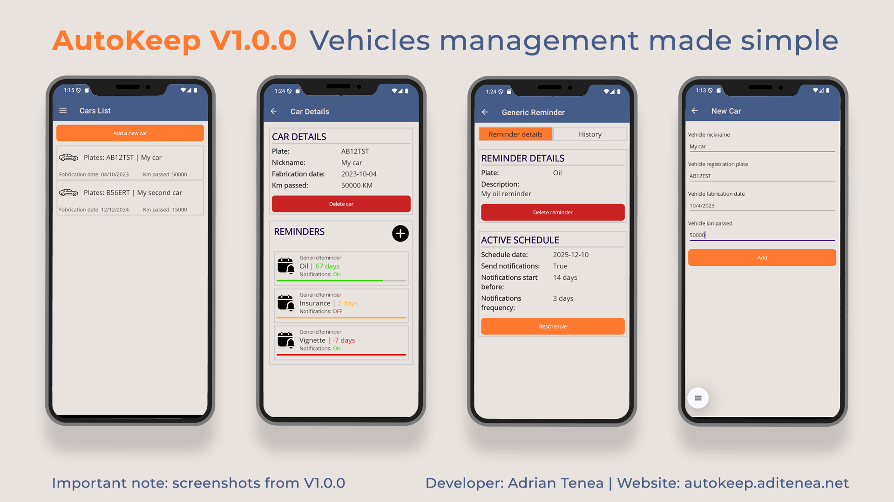

# AutoKeep

AutoKeep is a cross-platform .NET MAUI application designed to help users manage vehicle reminders and schedules efficiently.

## Features

- **Vehicle Management**: Add, view, and edit vehicles.
- **Reminder System**: Create, view, and reschedule generic reminders for vehicle-related tasks.
- **Scheduling**: Set up notification schedules with customizable intervals and lead times.
- **Persistent Storage**: Uses SQLite via Entity Framework Core for local data storage.
- **MVVM Architecture**: Clean separation of concerns using ViewModels and services.
- **Cross-Platform UI**: Unified user experience across supported platforms.

## Technologies Used

- [.NET 9](https://dotnet.microsoft.com/)
- [.NET MAUI](https://learn.microsoft.com/dotnet/maui/)
- [Entity Framework Core (SQLite)](https://learn.microsoft.com/ef/core/providers/sqlite/)
- [CommunityToolkit.Maui](https://learn.microsoft.com/dotnet/communitytoolkit/maui/)
- MVVM Pattern

## Coming Soon
- **Additional Vehicle Management Features**: Edit vehicles.
- **Popup Notifications**: Receive in-app notifications for upcoming reminders.

## Getting Started

### Prerequisites

- Visual Studio 2022 (latest version recommended)
- .NET 9 SDK
- MAUI workload installed (`dotnet workload install maui`)
- Android/iOS/MacCatalyst/Windows development environment as needed

### Building and Running

1. **Clone the repository**.
2. **Restore NuGet packages** (Visual Studio will do this automatically).
3. **Set `MauiClient` as the startup project**.
4. **Select the desired platform** (Android, iOS, MacCatalyst, Windows).
5. **Build and run** the project.

### Database Migrations

A separate `ConsoleApp` project is included to facilitate Entity Framework Core migrations.  
To create or update migrations:
